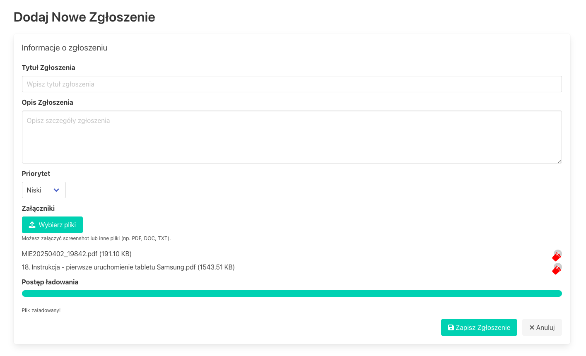
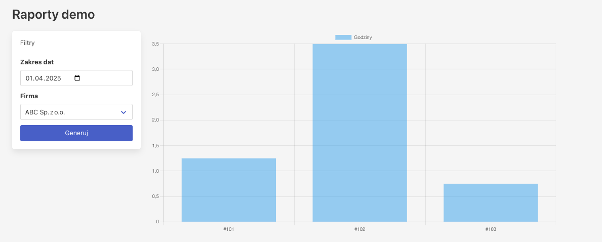
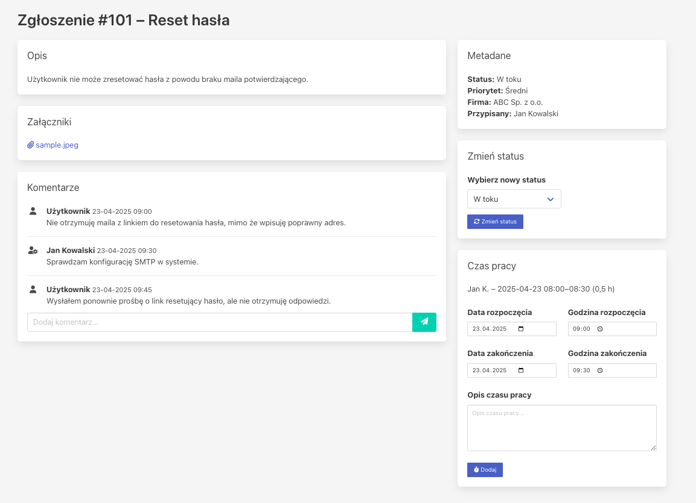
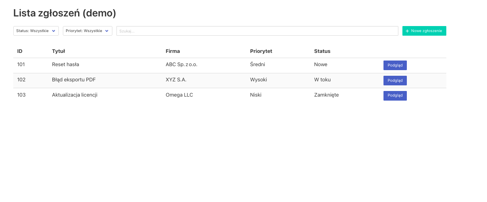

# 🇵🇱 ProjectNest
📌 ProjectNest – System do zarządzania zgłoszeniami i ewidencji czasu pracy
ProjectNest to nowoczesna i intuicyjna aplikacja umożliwiająca zarządzanie zgłoszeniami, rejestrowanie czasu pracy oraz nadzór nad projektami. System został stworzony z myślą o zespołach i firmach realizujących projekty wewnętrzne oraz zewnętrzne – z uwzględnieniem wymagań SLA.

## ✨ Kluczowe funkcje
- 📥 Obsługa zgłoszeń – Rejestrowanie, przypisywanie i śledzenie zgłoszeń serwisowych.
- 🕒 Ewidencja czasu pracy – Rejestrowanie godzin pracy w kontekście zadań i projektów.
- ⏱ Automatyczne wyliczanie SLA – Uwzględnia:
    - Godziny pracy: np. pon.–pt. od 8:00 do 16:00,
    - Dni ustawowo wolne od pracy (PL),
    - czas na podjęcie oraz rozwiązanie zgłoszenia,
- 📊 Nadzór projektowy – Monitorowanie postępów i czasu pracy zespołu.
- 📅 Raporty i analizy – Eksport danych o czasie pracy, SLA i wydajności.
- 🤝 Obsługa wielu ról – Interfejs dopasowany do ról (pracownik, kierownik, administrator)
- 🔌 API
## 🔧 Technologie
- Java 17
- Spring Boot
- API
- JPA / Hibernate
- Silniki bazodanowe: PostgreSQL (opcjonalnie MS SQL, Oracle Database, IBM DB2)

## 📈 Przykład działania
Zgłoszenie dodane w piątek o 15:45:30.
SLA na podjęcie = 12 godzin roboczych.
ProjectNest wyznacza termin odpowiedzi: wtorek, godz. 11:45:30, z pominięciem weekendu i godzin poza pracą.

## 📬 Kontakt
Jeśli są Państwo zainteresowani wersją demonstracyjną, testami lub współpracą – zapraszamy do kontaktu.

## 👨🏻‍💻 Demo
Wersja [demonstracyjna](https://erp.itsystems.com.pl/) wymagana rejestracja.

# 🇬🇧 Project Nest

## 📌 Ticket and Time Tracking System
ProjectNest is a lightweight and user-friendly system for managing support tickets, tracking work time, and supervising external or internal projects. The application is designed for teams and organizations that need a reliable tool for organizing tasks, handling SLA-based workflows, and reporting time spent across multiple projects or clients.

## ✨ Key Features
- 📥 Ticket Management – Submit, track, and prioritize support tickets.
- 🕒 Work Time Tracking – Record and assign working hours per task or project.
- ⏱ Automated SLA Calculation – SLA deadlines are calculated with respect to:
  - Business hours (eg. Monday to Friday, 08:00–16:00).
  - Polish public holidays (non-working days).
  - customize business hours to acknowledge and resolve a ticket.
- 📊 Project Monitoring – Track project progress and time spent across all team members.
- 📅 Reports and Analytics – Export time logs, SLA compliance, and performance summaries.
- 🤝 Multi-role Access – Interface adjusted to roles (employee, manager, admin).
- 🔌 API

## 🔧 Technologies Used
- Java 17
- Spring Boot
- JPA / Hibernate
- Database engine: PostreSQL, (optional MS SQL, Oracle Database, IBM DB2)

## 📈 Example Use Case
A support ticket is submitted on Friday at 15:45:30.
SLA to acknowledge = 12 business hours.
ProjectNest calculates the response deadline: Tuesday, 11:45:30 – skipping weekend and non-working hours.

## 📬 Contact
If you're interested in contributing, testing the demo, or getting early access, feel free to reach out.

## 👨🏻‍💻 Demo
Feel free to test [a demo cersion](https://erp.itsystems.com.pl). A register is required.
